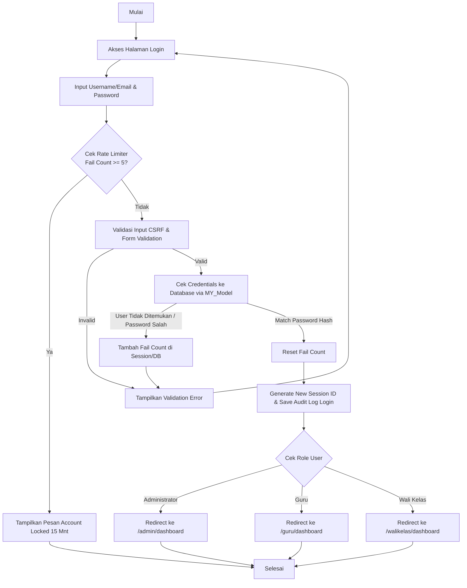
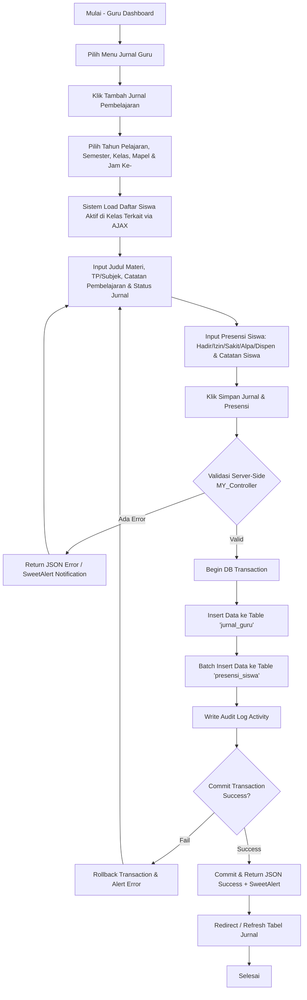
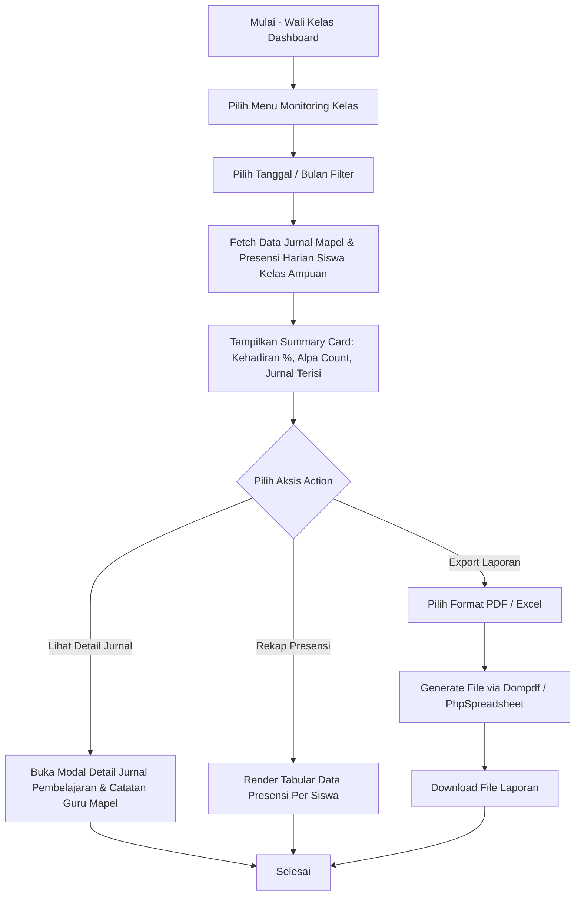
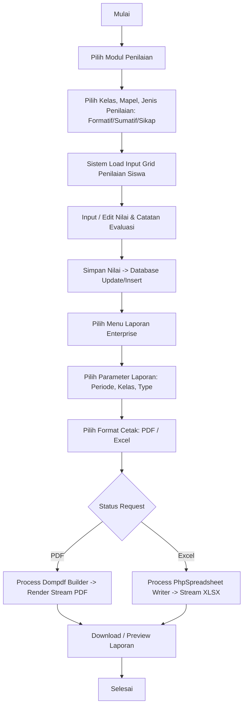

# DOKUMEN FLOWCHART SISTEM ENTERPRISE
## Website Jurnal Guru Enterprise (CodeIgniter 3 MVC)

### 1. Flowchart Autentikasi & Otorisasi Pengguna

---

### 2. Flowchart Pengisian Jurnal & Presensi Siswa (Workflow Guru)

---

### 3. Flowchart Monitoring & Rekapitulasi (Workflow Wali Kelas)

---

### 4. Flowchart Penilaian & Laporan Enterprise

