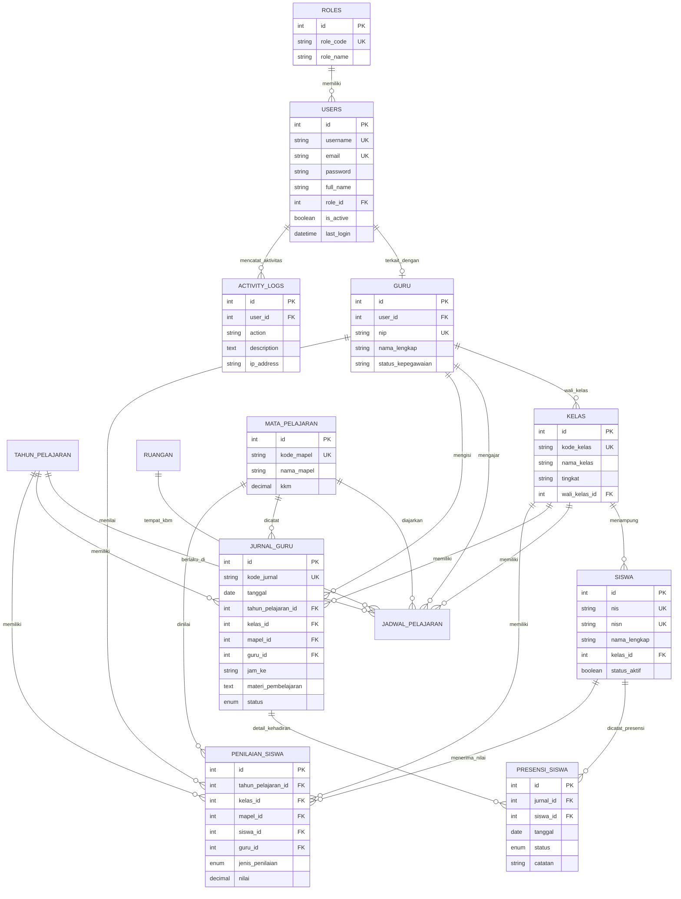

# DOKUMEN ENTITY RELATIONSHIP DIAGRAM (ERD)
## Website Jurnal Guru Enterprise (CodeIgniter 3 MVC)

### Diagram ERD Enterprise (Mermaid)

```mermaid
erDiagram
    ROLES ||--o{ USERS : "memiliki"
    USERS ||--o| GURU : "terkait_dengan"
    USERS ||--o{ ACTIVITY_LOGS : "mencatat_aktivitas"

    TAHUN_PELAJARAN ||--o{ JADWAL_PELAJARAN : "berlaku_di"
    TAHUN_PELAJARAN ||--o{ JURNAL_GURU : "memiliki"
    TAHUN_PELAJARAN ||--o{ PENILAIAN_SISWA : "memiliki"

    GURU ||--o{ KELAS : "wali_kelas"
    GURU ||--o{ JADWAL_PELAJARAN : "mengajar"
    GURU ||--o{ JURNAL_GURU : "mengisi"
    GURU ||--o{ PENILAIAN_SISWA : "menilai"

    KELAS ||--o{ SISWA : "menampung"
    KELAS ||--o{ JADWAL_PELAJARAN : "memiliki"
    KELAS ||--o{ JURNAL_GURU : "memiliki"
    KELAS ||--o{ PENILAIAN_SISWA : "memiliki"

    RUANGAN ||--o{ JADWAL_PELAJARAN : "tempat_kbm"

    MATA_PELAJARAN ||--o{ JADWAL_PELAJARAN : "diajarkan"
    MATA_PELAJARAN ||--o{ JURNAL_GURU : "dicatat"
    MATA_PELAJARAN ||--o{ PENILAIAN_SISWA : "dinilai"

    JURNAL_GURU ||--o{ PRESENSI_SISWA : "detail_kehadiran"
    SISWA ||--o{ PRESENSI_SISWA : "dicatat_presensi"
    SISWA ||--o{ PENILAIAN_SISWA : "menerima_nilai"

    USERS {
        int id PK
        string username UK
        string email UK
        string password
        string full_name
        int role_id FK
        boolean is_active
        datetime last_login
    }

    ROLES {
        int id PK
        string role_code UK
        string role_name
    }

    GURU {
        int id PK
        int user_id FK
        string nip UK
        string nama_lengkap
        string status_kepegawaian
    }

    KELAS {
        int id PK
        string kode_kelas UK
        string nama_kelas
        string tingkat
        int wali_kelas_id FK
    }

    SISWA {
        int id PK
        string nis UK
        string nisn UK
        string nama_lengkap
        int kelas_id FK
        boolean status_aktif
    }

    MATA_PELAJARAN {
        int id PK
        string kode_mapel UK
        string nama_mapel
        decimal kkm
    }

    JURNAL_GURU {
        int id PK
        string kode_jurnal UK
        date tanggal
        int tahun_pelajaran_id FK
        int kelas_id FK
        int mapel_id FK
        int guru_id FK
        string jam_ke
        text materi_pembelajaran
        enum status
    }

    PRESENSI_SISWA {
        int id PK
        int jurnal_id FK
        int siswa_id FK
        date tanggal
        enum status
        string catatan
    }

    PENILAIAN_SISWA {
        int id PK
        int tahun_pelajaran_id FK
        int kelas_id FK
        int mapel_id FK
        int siswa_id FK
        int guru_id FK
        enum jenis_penilaian
        decimal nilai
    }

    ACTIVITY_LOGS {
        int id PK
        int user_id FK
        string action
        text description
        string ip_address
    }
```
